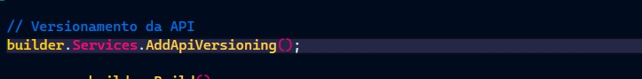

# CADASTRO_LOGIN_API

### SOBRE

*Esta é uma API teste para aprendizado e verificação de nível de conhecimento, e tem como função, efetuar cadastro de pessoas, persistir em um banco de dados MySQL, testar os verbos **GET, POST, PUT** e **DELETE**, Versionar os endpoints, implementação de migrations, efetuar login, autenticar via TokenJWT e etc.*

Obs: O projeto está sendo realizado em conjunto com o curso [REST API&#39;s RESTFul do 0 à Azure com ASP.NET 8 e 5 e Docker](https://www.udemy.com/course/restful-apis-do-0-a-nuvem-com-aspnet-core-e-docker/?couponCode=ST4MT73124).

---

Desenvolvedor: Danilo Holanda Araujo

---

### ESTRUTURA DO CONTEUDO

#### 1º Commit

* [Implementação da API e Teste de Endpoints.](#implementação-da-api-e-teste-de-endpoints)
* [Criação do Banco de Dados e CRUD pela API.](#criação-do-banco-de-dados-e-crud-pela-api)

#### 2º Commit

* [Versionamento de endpoints](#versionamento-de-endpoints)

#### 3º Commit

* Arquitetura em camadas.
* Atualização da estrutura do projeto.

#### 4º Commit

* Aplicação de migrations manualmente.

---

### Documentação Inicial

Neste projeto, implementamos uma API RESTful em ASP.NET Core com várias funcionalidades importantes:

**-** ****Cadastro de Usuários****: Permite cadastrar novos usuários e armazená-los em um banco de dados MySQL.
**-** ****Autenticação JWT****: Implementação de autenticação baseada em tokens JWT para proteger os endpoints.
**-** ****Verbos HTTP****: Testamos e utilizamos os verbos HTTP fundamentais: GET, POST, PUT, DELETE.
**-** ****Versionamento de API****: No segundo commit, adicionamos suporte para versionamento dos endpoints da API, permitindo evolução sem quebra de compatibilidade.

* #### Configuração do Projeto

Para configurar e executar o projeto localmente, siga as instruções abaixo:

**1. Clone o Repositório**

``````bash

git clone https://github.com/Daniloha/CadastroLoginAPI
cd cadastro_login_api
``````

**2.  Restaurar Dependências**

```bash
dotnet restore
```

**3.Executar o Projeto**

```bash
dotnet run
```

---

### 1º Commit

1. #### Implementação da API e Teste de Endpoints

Neste primeiro momento, eu criei um projeto WebAPI Asp .Net Core sem a implementação automática do swagger para poder adicionar manualmente no decorrer do projeto. Exclui o WeatherForecast.cs pois pertence ao exemplo criado inicialmente e alterei o nome do Controller para o contexto de minha API.


Criei a classe Pessoa em Models como formatada em [UML1](Models/pessoa.uxf).


Criei em seguida a interface e sua implementação contendo os serviços/métodos contidos na classe Pessoa e utilizados pelos verbos no Controller. Os métodos são:

* **Create**: Onde se pode criar/instanciar um objeto 'pessoa' pelo verbo POST.
* **FindAll**: Que lista todos os objetos 'pessoa' criados utilizando o verbo GET.
* **FindByID**: Utilizando o ID para localizar um objeto específico, também pelo GET.
* **Update**: Utilizando o POST, passamos os dados do objeto como parâmetro, alterando apenas os dados que queremos atualizar.
* **Delete**: Semelhante ao FindById, passamos o ID como parâmetro para que aquele objeto seja removido da coleção utilizando o verb DELETE.

E por fim, configurei o Controller com os métodos criados, configurei as interfacea em program.cs e testei no Postman.


2. #### Criação do Banco de Dados e CRUD pela API

Nesta etapa eu criei o banco de dados relacional pelo SGBD MySQL, Criei a primeira tabela 'Pessoa' e populei a primeira linha como exemplo/modelo:


Em seguida, eu defini as propriedades de conexão, e para isso, eu tive que adicionar uma dependência em meu projeto:

* [Pomelo EntityFramework](http://github.com/PomeloFoundation/Pomelo.EntityFrameworkCore.MySql)

Criei a classe de contexto de ações ORM em Models/Context:


Defini as configurações de conexão em appsettings.json:


Por fim eu adicionei o serviço de conexão ao meu program.cs e efetuei os testes pelo postman.


---

### 2º Commit

1. #### Versionamento de Endpoints

Este versionamento tem como principal função, permitir que os endpoints acompanhem as mudanças nas estruturas das entidades do projeto definidas pelo cliente sem sair do ambiente de produção.

2. #### Bibliotecas Utilizadas

   * [AspNet API Versioning](https://github.com/dotnet/aspnet-api-versioning/blob/main/README.md)
   * [Microsoft AspNetCore MVC Versioning](https://www.nuget.org/package/Microsoft.AspNetCore.Mvc.Versioning/)
3. #### Modificações

Em Properties, devemos acrescentar '/v1' as URLs em launchSettings.json/launchUrl.

Existem varias formas de versionar os endpoints do meu projeto por esta biblioteca. Utilizei a forma pelo controller como mostra a imagem abaixo, pois é a utilizada no curso e parece a escolha mais simples.


Por fim, eu adicionei o serviço de versionamento ao program.cs e efetuei os testes no Postman.



---

### 3º Commit

1. #### Arquitetura em Camadas

Até este momento, o projeto está com poucas camadas, o que engessa alguns pontos impossibilitando o crescimento da API e adição de regras de negócio.
Para resolver este alto acoplamento, eu adicionarei algumas camadas intermediárias, substituindo services por business e repository.


2. #### Business

O Business fica responsável pelas regras de negócio entre a chamada pelos endpoints da API e a busca no banco de dados.

3. #### Repository

Assim que tratadas pelo business, as requisições passam para o Repository onde fará a busca pelo resultado no banco de dados.
	
---

### 4º Commit

1. #### Aplicando Migrations
   
Aplicar migrations na aplicação, possibilita o versionamento de meus modelos em bancos de dados para alterar ou restaurar versões diferentes de tabelas/entidades.
Podemos criar versões diferentes adicionando colunas/atributos, removendo ou editando e depois restaurar se necessário.
   
2. #### Nugets Utilizadas

* [Evolve](https://www.nuget.org/packages/Evolve/3.2.0)
* [Serilog](https://www.nuget.org/packages/Serilog/4.0.1)
* [Serilog.AspNetCore](https://www.nuget.org/packages/Serilog.AspNetCore/8.0.2)
* [Serilog.Sinks.Console](https://www.nuget.org/packages/Serilog.Sinks.Console/6.0.0)

3. #### Implementação
    
Após a instalação dos Nugets, eu iniciei a implementação criando as tabelas para migrate com os modelos e em dataset para popular.
    
   
    
Em seguida eu criei a entidade livros, bem como o seu controler, repository e business e configurei as migrations o program.cs
    
---
    
 ### 5º Commit
 
 1. #### Generic Repository
 
 O objetivo deste repositório é reduzir a quantidade de códigos, ao invés de criar um repositorio para cada entidade, utilizamos um unico repositório genérico que será usado para todos, adicionando apenas particularidades em uma interface se necessário.
 
 2. #### Passo a Passo
 
* Primeiro eu exclui o repositório de Pessoas e Livros com suas implementações. Em seguida criei a pasta Generic com GenericRepository e IRepository.

* Em seguida eu modifiquei os BusinessImplementations para utilizar  o IRepository.

* Criei uma pasta Base em Models e criei a BaseEntity nela. em seguida modifiquei as entidades Livros e Pessoa para herdae a BaseEntity.

* Por fim, adaptei as injeções de dependência em Program.cs e efetuei os testes no Postman.

---

### 6º Commit

1. #### Value Object (VO)
...

---

### 7º Commit
 
 


